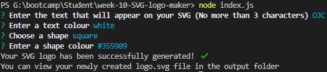
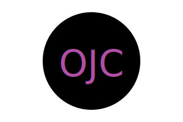

# week-10-SVG-logo-maker

## Purpose of Task

Creation of a command line application to allow users to quickly generate simple SVG logos. After running the application in the terminal, the user will be prompted with multiple questions, the answers to which will then be used to generate their SVG logo. This file will be placed in the **output** folder. This will be a node application making use of the inquirer, fs/promises and path modules.

## User Story

```md
AS a freelance web developer
I WANT to generate a simple logo for my projects
SO THAT I don't have to pay a graphic designer
```

## Acceptance Criteria

```md
GIVEN a command-line application that accepts user input
WHEN I am prompted for text
THEN I can enter up to three characters
WHEN I am prompted for the text color
THEN I can enter a color keyword (OR a hexadecimal number)
WHEN I am prompted for a shape
THEN I am presented with a list of shapes to choose from: circle, triangle, and square
WHEN I am prompted for the shape's color
THEN I can enter a color keyword (OR a hexadecimal number)
WHEN I have entered input for all the prompts
THEN an SVG file is created named `logo.svg`
AND the output text "Generated logo.svg" is printed in the command line
WHEN I open the `logo.svg` file in a browser
THEN I am shown a 300x200 pixel image that matches the criteria I entered
```

## Problems Solved

- When the user runs the application, they are prompted to answer a number of questions
    - The answers to these questions are used to generate their SVG logo
- The user cannot input more than three characters for the text that will appear on their logo
    - If the user attempts to submit more than three characters, the terminal will display the message 'Please enter no more than 3 characters' and the user will not be able to move onto the next question until they provide a valid input
- The user can enter either a colour keyword or a hex code as their text colour
- The user can pick either a circle, square or triangle from a list to be the shape for their logo
    - To move between the shapes the user should use the arrow keys
- The user can enter either a colour keyword or a hex code as their shape colour
- An SVG file is then created in the output folder named 'logo.svg'
- The user can then open this file in the browser and will see that it matches what their choices

## Screenshot

 

 

## Demonstration Video

A demonstration video is availabe here: https://drive.google.com/file/d/1qSTKZkvCT02jdyMRiVyJzItES0Z65vhN/view
